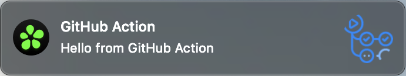

# ICQ Notify GitHub Action

[](https://stand-with-ukraine.pp.ua)


[](https://codecov.io/gh/fabasoad/icq-notify-action)

[ICQ Notify](https://github.com/fabasoad/icq-notify-action) GitHub Action.

## Inputs

| Name    | Required | Description                                | Default | Type             |
|---------|----------|--------------------------------------------|---------|------------------|
| token   | Yes      | ICQ API token                              |         | _&lt;String&gt;_ |
| to      | Yes      | Recipient. Can be chat id or user nickname |         | _&lt;String&gt;_ |
| message | No       | Text message                               |         | _&lt;String&gt;_ |
| file    | No       | File message                               |         | _&lt;String&gt;_ |

## Example

### Usage

```yaml
- uses: fabasoad/icq-notify-action@v2
  with:
    token: ${{ secrets.ICQ_TOKEN }}
    to: ${{ secrets.ICQ_TO }}
    message: 'Hello from GitHub Action'
    file: README.md
```

### Result



## Contributions


