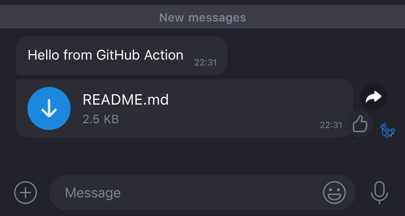

# ICQ Notify GitHub Action

[](https://stand-with-ukraine.pp.ua)


[](https://codeclimate.com/github/fabasoad/icq-notify-action/maintainability)
[](https://codeclimate.com/github/fabasoad/icq-notify-action/test_coverage)
[](https://snyk.io/test/github/fabasoad/icq-notify-action?targetFile=package.json)

[ICQ Notify](https://github.com/fabasoad/icq-notify-action) GitHub Action.

## Inputs

| Name    | Required | Description                                | Default | Type             |
|---------|----------|--------------------------------------------|---------|------------------|
| token   | Yes      | ICQ API token                              |         | _&lt;String&gt;_ |
| to      | Yes      | Recipient. Can be chat id or user nickname |         | _&lt;String&gt;_ |
| message | No       | Text message                               | `null`  | _&lt;String&gt;_ |
| file    | No       | File message                               | `null`  | _&lt;String&gt;_ |

## Example

### Usage

```yaml
name: ICQ Notify

on: push

jobs:
  job_1:
    name: Example
    runs-on: ubuntu-latest
    steps:
      - uses: actions/checkout@main
      - uses: fabasoad/icq-notify-action@main
        with:
          token: ${{ secrets.ICQ_TOKEN }}
          to: ${{ secrets.ICQ_TO }}
          message: 'Hello from GitHub Action'
          file: README.md
```

### Result


